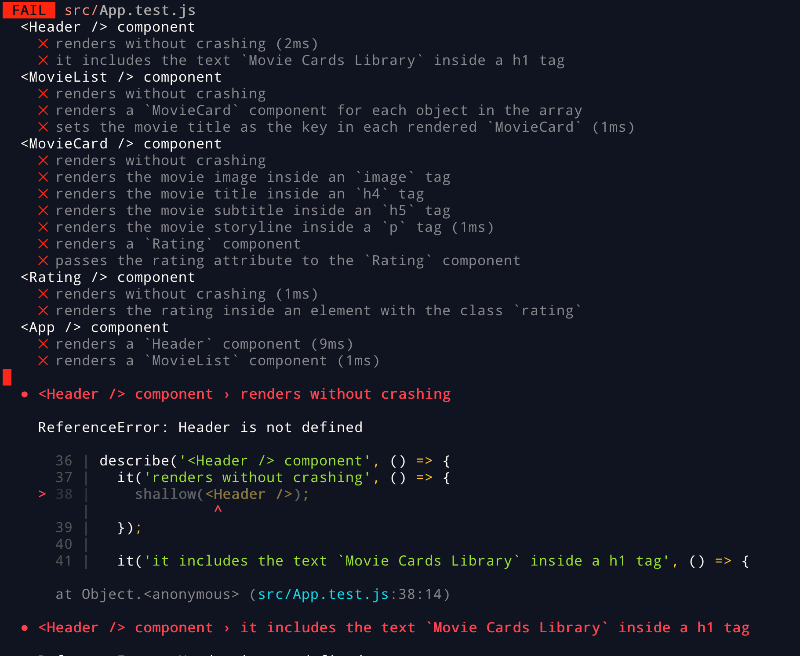
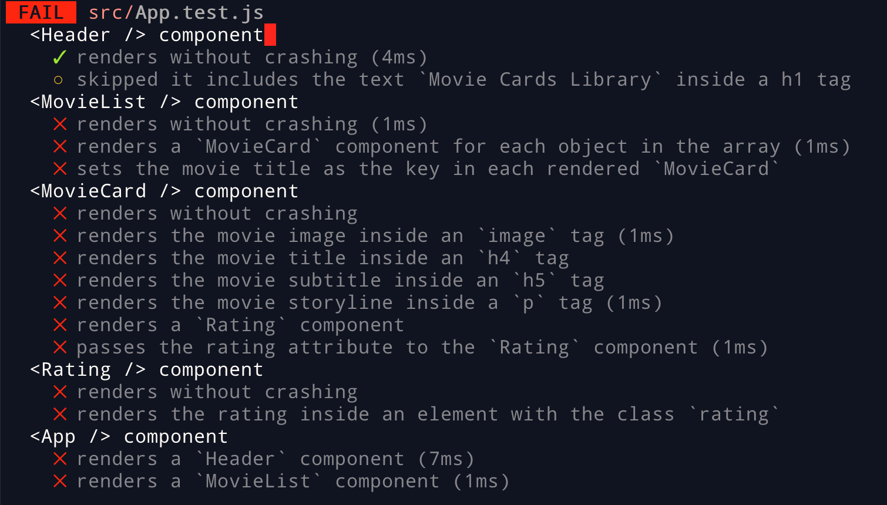

# Boas vindas ao repositório do projeto de Movie Cards Library Stateful!

Você já usa o GitHub diariamente para desenvolver os exercícios, certo? Agora, para desenvolver os projetos, você deverá seguir as instruções a seguir. Fique atento a cada passo, e se tiver qualquer dúvida, nos envie por _Slack_! #vqv 🚀

Aqui você vai encontrar os detalhes de como estruturar o desenvolvimento do seu projeto a partir deste repositório, utilizando uma branch específica e um _Pull Request_ para colocar seus códigos.

## O que deverá ser desenvolvido

Você deverá desenvolver uma aplicação que consiste em uma biblioteca de cartões de filmes dinâmica utilizando React. A biblioteca é composta por:

* Um cabeçalho;

* Uma barra de busca, utilizada pra filtrar quais cartões serão exibidos na lista de cartões;

* Uma lista de cartões, onde cada cartão representa um filme e possui uma imagem, título, subtítulo, sinopse e avaliação;

* Um formulário para adicionar um novo cartão na biblioteca.

Uma possível implementação dessa biblioteca consta abaixo.


Você precisará implementar componentes que em conjunto resultarão na biblioteca de cartões de filmes dinâmica.

## Desenvolvimento

Este repositório já contém um _template_ com um App React criado e configurado. Após clonar o projeto e instalar as dependências (mais sobre isso abaixo), você não precisará realizar nenhuma configuração adicional. Você deverá completar este _template_ implementando os requisitos listados na próxima seção.

### Componentes

Esse projeto contém os seguintes `React Components`:

   - Header
   - MovieLibrary
   - SearchBar
   - MovieList
   - MovieCard
   - Rating
   - AddMovie

`Header`, `MovieList`, `MovieCard` e `Rating` já estão implementados. `MovieLibrary`, `SearchBar` e `AddMovie` já estão criados, mas precisam ser implementados de forma a passarem nos requisitos listados abaixo.

Todos os componentes devem ser criados dentro da pasta `src/components`. **É obrigatório que seus componentes tenham exatamente os nomes listados acima**.

### Estado de componentes

Os componentes que **precisam** ter estado a ser gerenciado são:

   - MovieLibrary
   - AddMovie

## Testes

Todos os requisitos do projeto serão testados **automaticamente**. Cada componente possui vários requisitos. Os testes para cada requisito de um componente estão no arquivo de teste correspondente.

Nesse projeto será necessário incluir em vários elementos HTML o atributo **data-testid**. Ele será utilizado pelo avaliador para selecionar os elementos que serão testados. É como se fosse um id do HTML, porém somente utilizado para fins de teste. É muito importante que esses atributos sejam **exatamente iguais** aos descritos, caso contrário os testes irão falhar.

_**Por exemplo**: Os requisitos relacionados ao componente `SearchBar` estão no arquivo `SearchBar.test.js`._

Separe um tempo para ler estes arquivos e entender como os testes estão organizados.

Para executar os testes localmente, digite no terminal o comando `npm test`. Inicialmente, seus testes estarão assim:



A primeira parte da saída mostra um sumário de cada teste e seu status. Um ❌ representa um teste falhando, enquanto um ✅ representa um teste correto. Naturalmente, no início todos os testes estarão falhando.

Abaixo do sumário, para cada teste falhando, há uma mensagem explicativa sobre o motivo que causou a falha do teste, assim como a linha em que a falha ocorreu. Na imagem, vemos que o teste falha porque o componente `Header`, utilizado na linha 38, não está definido.

Se fizermos uma implementação simples do componente `Header`, que não renderiza nada:

```jsx
import React from 'react';

class Header extends React.Component {
  render() {
  }
}

export default Header;
```

E descomentarmos a linha que importa o componente `Header` em `App.test.js`:

```js
// import App from './App';
import Header from './components/Header';
// import MovieCard from './components/MovieCard';
// import MovieList from './components/MovieList';
// import Rating from './components/Rating';
```

Veremos que o primeiro teste agora passa:


Quando seu projeto estiver terminado, todos os testes deverão estar passando:


#### Dica: desativando testes

Especialmente no início, quando a maioria dos testes está falhando, a saída após executar os testes é bastante poluída. Você pode desabilitar temporariamente um teste utilizando a função `skip` junto à função `it`. Como o nome indica, esta função "pula" um teste:

```js
it.skip('it includes the text `Movie Cards Library` inside a h1 tag', () => {
  wrapper = shallow(<Header />);

  expect(wrapper.find('header h1').text()).toBe('Movie Cards Library');
});
```

Na saída da execução dos testes, você verá um  indicando que o teste está sendo pulado:



Uma estratégia é pular todos os testes no início e ir implementando um teste de cada vez, removendo dele a função `skip`.

⚠️ Lembre-se de não entregar o projeto com nenhum teste ignorado. **Testes ignorados serão tratados como testes falhando**. ⚠️

⚠️ **Não apague, em hipótese alguma, qualquer teste ou arquivo deste repositório.**. ⚠️


#### Dica: watch mode

Ao executar os testes localmente, [Jest](https://jestjs.io/), a ferramenta que executa os testes, entra em _watch mode_. Nesse modo, a cada vez que um arquivo é salvo, os testes são executados novamente. Isso pode aumentar sua produtividade removendo a necessidade de executar os testes manualmente o tempo todo. Você pode abrir uma aba no seu terminal ou no terminal do _VSCode_ e deixar o _Jest_ rodando nesse modo.

## Requisitos do projeto

⚠️ Lembre-se que o seu projeto só será avaliado se estiver passando por **todos os _checks_** do **CodeClimate**. Use o _check_ do **TravisCI** para medir o seu progresso em relação aos requisitos! 😉

#### Crie um componente chamado `SearchBar`

Esse componente renderizará uma barra com filtros acima da listagem de cartões. Quais cartões serão mostrados no componente `MovieList` dependerá dos filtros escolhidos. `SearchBar` deve receber como props:

  - `searchText`, uma string
  - `onSearchTextChange`, uma callback
  - `bookmarkedOnly`, um boolean
  - `onBookmarkedChange`, uma callback
  - `selectedGenre`, uma string
  - `onSelectedGenreChange`, uma callback

O que será validado: 
  - Será validado se o componente `SearchBar` renderiza com sucesso 


#### Renderize um formulário dentro de `SearchBar`

Dentro desse formulário haverá campos usados na filtragem de cartões.

- Esse formulário deve apresentar o atributo `data-testid="search-bar-form"`

O que será validado:
  - Será validado se é renderizado 1, e apenas 1, form dentro de `SearchBar` com sucesso 


#### Renderize um input do tipo texto dentro do formulário em `SearchBar`

- O input deve ter uma label associada com o texto: **"Inclui o texto:"**;

- Essa label deve apresentar o atributo `data-testid="text-input-label"`

- A propriedade `value` do input deve receber o valor da prop `searchText`;

- A propriedade `onChange` do input deve receber o valor da prop `onSearchTextChange`.

- Esse input deve apresentar o atributo `data-testid="text-input"`

O que será validado:
  - Será validado que 1, e apenas 1, input de texto é renderizado dentro do forms 
  - Será validado que o input de texto contém a label "Inclui o texto" 
  - Será validado se o input de texto tem o valor passado pela props `searchText` 
  - Será validado que a props `onSearchTextChange` é passada para o atributo `onChange` do input 
  

#### Renderize um input do tipo checkbox dentro do formulário em `SearchBar`

- O input deve ter uma label associada com o texto: **"Mostrar somente favoritos"**;

- Essa label deve apresentar o atributo `data-testid="checkbox-input-label"`

- A propriedade `checked` do input deve receber o valor da prop `bookmarkedOnly`;

- A propriedade `onChange` do input deve receber o valor da prop `onBookmarkedChange`.

- Esse input deve apresentar o atributo `data-testid="checkbox-input"`

O que será validado:
  - Será validado se uma checkbox é renderizada dentro do form 
  - Será validado que o checkbox tem a label "Mostrar somente favoritos" 
  - Será validado que a prop `bookmarkedOnly` é passada para o atributo `checked` do input 
  - Será validado que a prop `onBookmarkedChange` é passada para o atributo `onChange` do input 
  

#### Renderize um select dentro do formulário em `SearchBar`

- O select deve ter uma label associada com o texto: **"Filtrar por gênero"**;

- Essa label deve apresentar o atributo `data-testid="select-input-label"`

- A propriedade `value` do select deve receber o valor da prop `selectedGenre`;

- A propriedade `onChange` do input deve receber o valor da prop `onSelectedGenreChange`;

- O `select` deve renderizar quatro tags `option`, com as opções de filtragem por gênero, na seguinte ordem:
   - `Todos`, com o valor `""`;
   - `Ação`, com o valor `action`;
   - `Comédia`, com o valor `comedy`;
   - `Suspense`, com o valor `thriller`.

- O select deve apresentar o atributo `data-testid="select-input"`

- Cada `option` deve apresentar o atributo `data-testid="select-option"`

O que será validado:
  - Será validado que um select é renderizado dentro do form 
  - Será validado se o componente tem uma label com o texto "Filtrar por gênero" 
  - Será validado se a prop `selectedGenre` é passada como valor do select 
  - Será validado se a prop `onSelectedGenreChange` é passada para o atributo `onChange` do select 
  - Será validado se são renderizadas 4 options dentro do select com os textos e valores, respectivamente: Todos e \'\', Ação e action, Comédia e comedy, Suspense e thriller  

#### Crie um componente chamado `AddMovie`

Esse componente renderizará um formulário que permite adicionar na biblioteca um novo cartão de filme, dadas as seguintes informações do novo filme:

  - subtítulo
  - título
  - caminho da imagem
  - sinopse
  - avaliação
  - gênero

`AddMovie` deve receber como props:

  - `onClick`, uma callback
  
- O formulário deve apresentar o atributo `data-testid="add-movie-form"`

O que será validado: 
  - Será validado se o componente renderiza 
  - Será validado se o componente renderiza 1, e apenas 1, form 

#### Configure o estado inicial do componente `AddMovie`

O componente `AddMovie` possui como estado as seguintes propriedades:

  - `subtitle`: guarda o subtítulo preenchido no formulário por quem usa a aplicação;
  - `title`: guarda o título preenchido no formulário por quem usa a aplicação;
  - `imagePath`: guarda o caminho da imagem preenchido no formulário por quem usa a aplicação;
  - `storyline`: guarda a sinopse do filme escrita no formulário por quem usa a aplicação;
  - `rating`: guarda a nota de avaliação dada no formulário por quem usa a aplicação;
  - `genre`: guarda o gênero do filme selecionado no formulário por quem usa a aplicação.

Ou seja, o estado de `AddMovie` contém as informações do novo filme que foram inseridas por quem usa a aplicação.

O estado inicial do componente `AddMovie` deve ser:

  - `subtitle`: '';
  - `title`: '';
  - `imagePath`: '';
  - `storyline`: '';
  - `rating`: 0;
  - `genre`: 'action'.


#### Renderize um formulário dentro de `AddMovie`

Dentro desse formulário haverá campos usados para preencher informações do novo cartão a ser adicionado na biblioteca.


#### Renderize um input do tipo texto dentro do formulário em `AddMovie` para obter o título do novo filme

- O input deve ter uma label associada com o texto: **"Título"**;

- Essa label deve apresentar o atributo `data-testid="title-input-label"`

- O input deve ter seu valor inicial provido pelo estado inicial do componente, via `title`;

- Esse input deve apresentar o atributo `data-testid="title-input"`

- A propriedade `onChange` deve atualizar o estado de `AddMovie`, atribuindo a `title` o atual título contido no input.

O que será validado:
  - Será validado se o componente renderiza um input de texto para quem usa escrever o titulo do filme 
  - Será validado se o componente renderiza a label "Título" para o input de titulo 
  - Será validado se o estado inicial do titulo é "", ou seja, uma string vazia 
  - Será validado se o valor do input de título muda quando algo é digitado por quem usa.
  


#### Renderize um input do tipo texto dentro do formulário em `AddMovie` para obter o subtítulo do novo filme

- O input deve ter uma label associada com o texto: **"Subtítulo"**;

- Essa label deve apresentar o atributo `data-testid="subtitle-input-label"`

- O input deve ter seu valor inicial provido pelo estado inicial do componente, via `subtitle`;

- Esse input deve apresentar o atributo `data-testid="subtitle-input"`

- A propriedade `onChange` deve atualizar o estado de `AddMovie`, atribuindo a `subtitle` o atual subtítulo contido no input.

O que será validado:
  - Será validado se o componentee renderiza um input de texto para quem usa escrever o subtítulo do filme 
  - Será validado se o component renderiza a label "Subtítulo" para o input de subtitulo 
  - Será validado se o estado inicial do subtitulo é "", ou seja, uma string vazia 
  - Será validado se o valor do input de subtitulo muda quando algo é digitado pelo usuário 
  

#### Renderize um input do tipo texto dentro do formulário em `AddMovie` para obter o caminho da imagem do novo filme

- O input deve ter uma label associada com o texto: **"Imagem"**;

- Essa label deve apresentar o atributo `data-testid="image-input-label"`

- O input deve ter seu valor inicial provido pelo estado inicial do componente, via `imagePath`;

- Esse input deve apresentar o atributo `data-testid="image-input"`

- A propriedade `onChange` deve atualizar o estado de `AddMovie`, atribuindo a `imagePath` o atual caminho da imagem contido no input.

O que será validado:
  - Será validado se o componente renderiza um input de texto para quem usa inserir a url da imagem do filme 
  - Será validado se o componente renderiza a label "Imagem" para o input de imagem 
  - Será validado se o estado inicial do input de imagem é "", ou seja, uma string vazia 
  - Será validado se o valor do input de imagem muda quando algo é digitado por quem usa 
  

#### Renderize uma `textarea` dentro do formulário em `AddMovie` para obter a sinopse do novo filme

- A `textarea` deve ter uma label associada com o texto: **"Sinopse"**;

- Essa label deve apresentar o atributo `data-testid="storyline-input-label"`

- A `textarea` deve ter seu valor inicial provido pelo estado inicial do componente, via `storyline`;

- Essa `textarea` deve apresentar o atributo `data-testid="storyline-input"`

- A propriedade `onChange` deve atualizar o estado de `AddMovie`, atribuindo a `storyline` a sinopse atual continda na `textarea`.

O que será validado:
  - Será validado se o componente renderiza um input de texto para quem usa escrever a sinopse do filme 
  - Será validado se o componente renderiza a label "Sinopse" para o input de sinopse 
  - Será validado se o estado inicial do input de sinopse é "", ou seja, uma string vazia 
  - Será validado se o valor do input de sinopse muda quando algo é digitado por quem usa 
  

#### Renderize um `input` do tipo `number` dentro do formulário em `AddMovie` para obter a avaliação do novo filme

- O `input` deve ter uma label associada com o texto: **"Avaliação"**;

- Essa label deve apresentar o atributo `data-testid="rating-input-label"`

- O `input` deve ter seu valor inicial provido pelo estado inicial do componente, via `rating`;

- Essa `input` deve apresentar o atributo `data-testid="rating-input"`

- A propriedade `onChange` deve atualizar o estado de `AddMovie`, atribuindo a `rating` a avaliação atual continda no input.

O que será validado:
  - Será validado se o componente renderiza um input de texto para quem usa escrever a avaliação do filme 
  - Será validado se o componente renderiza a label "Avaliação" para o input de avaliação 
  - Será validado se o estado inicial do input de avaliação é 0 
  - Será validado se o valor do input de avaliação muda quando algo é digitado por quem usa 
  

#### Renderize um `select` do formulário em `AddMovie` para selecionar o gênero do novo filme

- O `select` deve ter uma label associada com o texto: **"Gênero"**;

- Essa label deve apresentar o atributo `data-testid="genre-input-label"`

- O `select` deve ter seu valor inicial provido pelo estado inicial do componente, via `genre`;

- Essa `input` deve apresentar o atributo `data-testid="genre-input"`

- A propriedade `onChange` deve atualizar o estado de `AddMovie`, atribuindo a `genre` o gênero atual selecionado;

- O `select` deve renderizar três tags `option`, com as opções de filtragem por gênero, na seguinte ordem:
   - `Ação`, com o valor `action`;
   - `Comédia`, com o valor `comedy`;
   - `Suspense`, com o valor `thriller`.

- Cada `option` deve conter o atributo `data-testid="genre-option"`

O que será validado:
  - Será validado se o componente renderiza um select com 3 opções de genero de filme 
  - Será validado se o componente renderiza a label "Gênero" para o select de gênero 
  - Será validado se todas as opções no select tem o texto e o valor esperados, que são, respectivamente: Ação e action, Comédia e comedy, Suspense e thriller 
  - Será validado se o gênero selecionado inicialmente é o "action" 
  - Será validado se o valor do gênero muda quando um gênero diferente é escolhido no select 


#### Renderize um botão do formulário em `AddMovie` para fazer uso dos dados do novo filme, contidos no estado de `AddMovie`

- O botão precisa ter escrito o seguinte texto: **"Adicionar filme"**;

- O botão deve conter o atributo `data-testid="send-button"`

- A propriedade `onClick` do botão invoca uma função definida por você, em `AddMovie`, que:
  - Executa a callback passada para o componente `AddMovie` via props, chamada `onClick`, que recebe como parâmetro o estado atual de `AddMovie`;
  - Reseta o estado de `AddMovie`, voltando para o inicial, conforme mencionado anteriormente.

O que será validado:
  - Será validado se o texto do botão é "Adicionar filme" 
  - Será validado se o evento onClick é chamado ao se clicar no botão. 
  - Será validado se o estado dos inputs volta ao inicial depois que o botão de adicionar é clicado. 

#### Crie um componente chamado `MovieLibrary`

Esse componente renderizará a biblioteca de filmes que renderizará a `searchBar` e o `addMovies` para filtrar por filmes e adicionar um filme à biblioteca respectivamente.

`MovieLibrary` deve receber como props:

  - `movies`, um array

O que será validado: 
  - Será validado se o componente é renderizado com sucesso 


#### Configure o estado inicial do componente `MovieLibray`

O componente `MovieLibrary` possui como estado as seguintes propriedades:

  - `searchText`: guarda o texto de busca por filmes;
  - `bookmarkedOnly`: um _boolean_ que guarda se é para filtrar por filmes favoritados ou não;
  - `selectedGenre`: guarda o gênero do filme selecionado para poder fazer a filtragem;
  - `movies`: guarda a lista de filmes.

Ou seja, o estado de `MovieLibrary` contém a lista de filmes e os filtros a serem aplicados sobre a listagem.

O estado inicial do componente `MovieLibrary` deve ser:

  - `searchText`: '';
  - `bookmarkedOnly`: false;
  - `selectedGenre`: '';
  - `movies`: a lista de filmes passadas pela props `movies`.

O que será validado:
  - Será validado se o `searchText` é inicializado com uma string vazia 
  - Será validado se o `bookmarkedOnly` é inicializado com o boleano `falso` 
  - Será validado se o `selectedGenre` é inicializado com uma string vazia 
  - Será validado se o todos os `movies` são renderezidados. 


#### Renderize `SearchBar` dentro de `MovieLibrary`

- `searchText` oriundo do estado de `MovieLibrary` deve ser passado para a prop `searchText` de `SearchBar`;

- A callback para atualizar o estado de `MovieLibrary` em `searchText` precisa ser passada para `SearchBar`;

- `bookmarkedOnly` oriundo do estado de `MovieLibrary` deve ser passado para a prop `bookmarkedOnly` de `SearchBar`;

- A callback para atualizar o estado de `MovieLibrary` em `bookmarkedOnly` precisa ser passada para `SearchBar`;

- `selectedGenre` oriundo do estado de `MovieLibrary` deve ser passado para a prop `selectedGenre` de `SearchBar`;

- A callback para atualizar o estado de `MovieLibrary` em `selectedGenre` precisa ser passada para `SearchBar`.

O que será validado:
  - Será validado se um componente `SearchBar` é renderizado 
  - Será validado se o estado da `SearchBar` muda quando quem usa digita algo 
  - Será validado que é possivel selecionar a opção de filtrar por favoritos` 
  - Será validado que é possivel escolher uma categoria uma categoria de filme para filtrar 


#### Renderize `MovieList` dentro de `MovieLibrary`

- Deve passar para a prop `movies` de `MovieList` todos os filmes filtrados;

- Quando o estado para `bookmarkedOnly` é falso, não é alterada a listagem de filmes a ser renderizada;

- Quando o estado para `bookmarkedOnly` é verdadeiro, deve ser renderizado por `MovieList` somente filmes favoritados;

- Quando o estado para `selectedGenre` é vazio, não é alterada a listagem de filmes a ser renderizada;

- Quando o estado para `selectedGenre` não é vazio, deve ser renderizado somente filmes com o mesmo gênero;

- Quando o estado para `searchText` é vazio, não é alterada a listagem de filmes a ser renderizada;

- Quando o estado para `searchText` não é vazio, deve ser renderizado por `MovieList` filmes que satisfaçam a uma das condições abaixo:
  - Filmes cujo título contém o que está presente em `searchText`, **ou**;
  - Filmes cujo subtítulo contém o que está presente em `searchText`, **ou**;
  - Filmes cuja sinopse contém o que está presente em` searchText`.

O que será validado:
  - Será validado que o componente `MovieList` é renderizado com sucesso 
  - Será validado se a barra de buscas filtra os filmes por titulo 
  - Será validado se a barra de buscas filtra os filmes por subtítulo 
  - Será validado se a barra de buscas filtra os filmes por sinopse 
  - Será validado se a lista de filmes é renderizada sem filtragens se a barra de buscar estiver vazia 
  - Será validado que é possivel filtrar por favoritos 
  - Será validado que é possivel filtrar por categoria 


#### Renderize `AddMovie` dentro de `MovieLibrary`

- A callback que permite adicionar um novo filme ao final da lista precisa ser passada para `AddMovie`.

O que será validado:
  - Será validado se o componente `AddMovie` é renderizado com sucesso 
  - Será validado se é possível adicionar um novo filme a lista de filmes 

#### Adicione proptypes a todos os componentes

Todos os compontens que recebem props devem ter suas proptypes corretamente declaradas. O eslint checa automaticamente declaração de proptypes, portanto seu Pull Request deverá passar no Code Climate para satisfazer esse requisito.


---

## Instruções para entregar seu projeto:

### ANTES DE COMEÇAR A DESENVOLVER:

1. Instale as dependências, inicialize o projeto e rode os testes
  * Instale as dependências:
    * `npm install`
  * Inicialize o projeto:
    * `npm start` (uma nova página deve abrir no seu navegador com um texto simples)
  * Verifique que os testes estão executando:
    * `npm test` (os testes devem rodar e falhar)

### DURANTE O DESENVOLVIMENTO

* ⚠ **PULL REQUESTS COM ISSUES NO CODE CLIMATE NÃO SERÃO AVALIADAS, ATENTE-SE PARA RESOLVÊ-LAS ANTES DE FINALIZAR O DESENVOLVIMENTO!** ⚠
